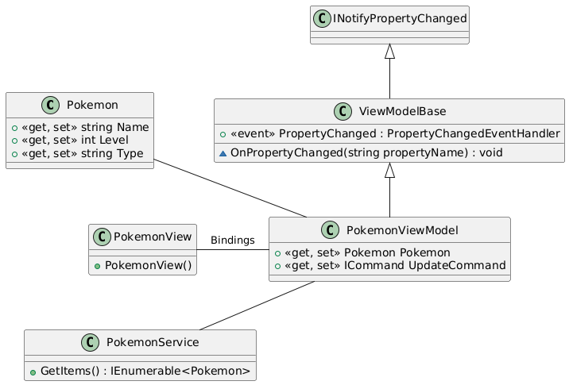

# 

## La Rochelle Software Craftsmenship

* **Auteurs:**

  * [Sébastien NEDJAR](mailto:sebastien.nedjar@univ-amu.fr)

* **Besoin d'aide ?**

  * Consulter et/ou créer des [issues](https://github.com/CraftLR/RemoteDevelopmentCsharpWithAvaloniaUI/issues).
  * [Email](mailto:sebastien.nedjar@univ-amu.fr) pour toutes questions autres.

## Aperçu du workshop et objectifs d'apprentissage

Développer une application graphique est une tache importante et complexe pour les équipes techniques. L'IHM est généralement la partie la plus proche de l'utilisateur. En plus de devoir atteindre une complétude fonctionnelle maximale, l'IHM doit prendre en compte des facteurs comme l'ergonomie, l'esthétique ou l'expérience utilisateur qui demandent une expertise à part entière pour chacun d'entre eux. Dans les équipes, le développeur front, ne peut donc pas se préoccuper uniquement des problématiques techniques. Pour faciliter ce travail, il faut autant que possible séparer les responsabilités (separation of concerns (SoC) en anglais) pour réussir à gérer des parties de l'application avec des objectifs qui peuvent parfois sembler contradictoires.

L'architecture technique devant être le reflet de l'organisation humaine du projet, depuis très longtemps, l’ingénierie logicielle s'est préoccupé de cette problématique en proposant des découpages sémantiques permettant aux équipes d'avoir des ensembles cohérents pour chaque préoccupation (concern en anglais). Que ce soit dans les architecture [trois tiers](https://fr.wikipedia.org/wiki/Architecture_trois_tiers) comme dans leur généralisation (les architecture multi-tiers), l'architecture logique du système est divisée en trois niveaux ou couches :

* couche présentation ;
* couche métier ;
* couche d'accès aux données.

L'implémentation de cette séparation dans les langages objets passe par l'utilisation de [design patterns (patrons de conception)](https://fr.wikipedia.org/wiki/Patron_de_conception) tel que le [MVP](https://fr.wikipedia.org/wiki/Mod%C3%A8le-vue-pr%C3%A9sentation), le [MVC](https://fr.wikipedia.org/wiki/Mod%C3%A8le-vue-contr%C3%B4leur) ou le [MVVM](https://fr.wikipedia.org/wiki/Mod%C3%A8le-vue-vue_mod%C3%A8le). Dans chacun d'eux, on retrouve toujours la vue (qui représente ce que voit l'utilisateur) et le modèle (qui doit implémenter la logique métier). La communication entre les deux couches est la principale différence entre les variantes de ces patrons de conception.

En plus de vous faire toucher du doigt la problématique de séparation des préoccupations dans un développement logiciel, cet atelier vise à vous faire mettre en œuvre le pattern MVVM sur des applications graphiques simples. Le framework utilisé est [AvaloniaUI](https://avaloniaui.net/). Ce framework est très similaire à [WPF(Windows Presentation Foundation)](https://learn.microsoft.com/fr-fr/dotnet/desktop/wpf/overview/?view=netdesktop-6.0) de Microsoft mais il a l'avantage d'être multi-plateforme et surtout totalement compatible avec .NET 6 et .NET 7. L'utilisation du langage de balisage XAML pour décrire la vue, le rend très adapté à l'utilisation avec MVVM.

## Applications graphiques multi-plateforme en C# et architecture MVVM  

Une base de code portable et maintenable est importante, en particulier dans les implémentations .NET à grande échelle et multi-plateformes. Sur les plates-formes basées sur XAML, telles que Windows Presentation Foundation (WPF), Universal Windows Platform (UWP), Xamarin Forms et AvaloniaUI, il est possible d'atteindre des objectifs de maintenabilité en implémentant le modèle [MVVM](https://learn.microsoft.com/en-us/previous-versions/msp-n-p/hh848247(v=pandp.10)).

MVVM signifie Model-View-ViewModel, où le Modèle représente les services, des objets de transfert de données et des entités de base de données liés au domaine de l'application, la Vue est l'interface utilisateur et la responsabilité de la Vue-Modèle est de lier ces deux couches de manière adéquate. La ViewModel encapsule l'interaction avec le modèle, exposant les propriétés et les commandes de l'interface utilisateur XAML à lier.

Chacun des exemples donnés pourra sans problème remplacer la vue en XAML (ciblant WPF, UWP, Xamarin Forms ou AvaloniaUI) sans toucher au code des deux autres couches.

La première chose à faire est de créer un fork de ce dépôt.


Le code de départ de ce dépôt est basé sur celui de [l'environnement de distant de développement d'application graphique en C#](https://github.com/CraftLR/RemoteDevelopmentCsharpWithAvaloniaUI). Il explique comment coder au-travers d'un conteneur Docker directement depuis Microsoft Visual Studio Code, et utiliser diverses métriques de code.


### Lancement de l'application graphique d'exemple

Pour commencer à tester AvaloniaUI, deux applications très simples sont présente dans le présent dépôt git. La première est juste une fenêtre avec 3 boutons pour illustrer les concepts de base d'AvaloniaUI. Elle s'appelle `CraftLR.UI` et se trouve dans le dossier `src/CraftLR.UI`.

Pour pouvoir la tester, effectuez le build et exécutez le programme avec l'éxecution sans débogage (<kbd>Ctrl/Cmd</kbd>+<kbd>F5</kbd>.

Une autre option est d' ouvrir un terminal (avec le raccourci clavier  <kbd>Ctrl/Cmd</kbd>+<kbd>ù</kbd>) et tapez les commandes suivantes :

```sh
cd src/CraftLR.UI
dotnet restore
dotnet build
dotnet run
```


### Premières applications graphiques : composants et événements

Pour placer des composants dans une fenêtre, nous utiliserons principalement le conteneur `DockPanel`. Ce conteneur est un panneau simple qui permet de placer des composants enfants dans cinq zones : `Top`, `Bottom`, `Left`, `Right`. Le dernier composant placé utilisera la place restante au centre du panneau.

Un seul objet graphique (composant, conteneur, …) peut être placé dans chacun de ces emplacements. Le conteneur `DockPanel` est fréquemment utilisé comme conteneur racine, car il correspond à une division assez classique de la fenêtre principale d'une application (barre de titre, barre d'état, zone d'options, zone principale, etc.).

Le `DockPanel` est l'un des nombreux type de panneau qui permet de gérer la disposition des composants graphiques. Les panneaux peuvent être imbriqué les un dans les autres à la manière des poupées russes si nécessaire mais généralement pour des raison de lisibilité, on préfère utiliser les grilles (classe `Grid`) lorsque l'on doit faire des arrangements complexes.

#### Exercice 1

Ouvrez la classe `HelloLabel` et modifiez-la pour que votre application affiche une fenêtre respectant les contraintes suivantes :

* Le titre de la fenêtre principale doit être "Hello Label !".

* La fenêtre doit avoir une largeur de 250 et une hauteur de 100.

* La fenêtre doit avoir pour racine un nœud du type `DockPanel`

* Les éléments de ce panneau devront être centrés horizontalement et verticalement

* Au centre de ce `DockPanel`, placez un `TextBlock` (voir la documentation de cette classe) ayant pour `Text` la chaîne `Hello !`

* La fenêtre doit être visible

Exécutez l'application pour vérifier le fonctionnement de cette fenêtre. Redimensionnez-la pour voir comment se comporte votre `TextBlock`.

Logiquement, vous devriez avoir un résultat ressemblant à cela :


#### Exercice 2

Les blocs de texte `TextBlock` sont des composants pour afficher un texte. Ils sont souvent utilisés conjointement avec des composants comme les `TextBox` (ou tout autre composant de saisie). Maintenant que nous avons vu ce composant passif, nous allons voir le premier avec lequel nous pouvons interagir : le `Button`.

Ouvrez la classe `HelloButton` et modifiez-la pour que votre application affiche une fenêtre respectant les mêmes contraintes qu'à l'exercice précédent, mais à la place d'un `TextBlock`, vous utiliserez un `Button` (voir la documentation de cette classe) ayant pour texte la chaîne `Hello !`.

Exécutez l'application pour vérifier le fonctionnement de cette fenêtre.

#### Exercice 3

Pour l'instant le bouton est très simple. Ajoutez-lui quelques décorations pour qu'il soit plus esthétique.

Ouvrez la classe `HelloBeautifulButton` et modifiez-la pour que votre application affiche une fenêtre respectant les contraintes suivantes :

* Respecter toutes les contraintes de l'exercice précédent

* Construire un objet du type `Image` ouvrant l'image `logo.png` située dans le dossier `Assets`.

* Positionner cette image comme à l’intérieur du bouton.

* Ajouter [les éléments de style](https://docs.avaloniaui.net/docs/styling) pour améliorer l'apparence de l'application en ayant un rendu sombre.

* Agrandir la hauteur de la scène à 250

Exécuter l'application pour vérifier le fonctionnement de cette fenêtre.

#### Exercice 4

Bien que le bouton soit un peu plus attrayant, il n'est pour l'instant pas très interactif. Généralement, l'utilisateur s'attend à ce qu'un bouton lance un traitement lorsqu'on l'actionne. Pour ce faire, C# permet de réagir aux événements avec le mécanisme des écouteurs (`Listener`).

Pour qu'un *écouteur* soit appelé au bon moment (lorsqu'un événement est déclenché par une action extérieure), il faut qu'il s'enregistre auprès de l'objet qu'il souhaite écouter. Pour la classe `Button`, c'est la méthode `setOnAction()` qui permet à un écouteur de s'enregistrer pour être informé quand le bouton est actionné.

Ouvrez donc la classe `HelloBeautifulUsefulButton` et la vue XAML associée, puis implémentez-les en respectant les contraintes suivantes :

* Le bouton doit réagir à l'événement `Click` en appelant la méthode `Button_OnClick`

* La méthode `Button_OnClick(object sender, RoutedEventArgs eventData)` de la classe se contente d'afficher le texte "Bouton actionné" sur la sortie standard.

* `HelloBeautifulUsefulButton` doit respecter les mêmes contraintes que `HelloBeautifulButton`.

Exécutez l'application pour vérifier le fonctionnement de cette fenêtre.

L'utilisation de la classe associée à la vue XAML permet de facilement ajouter de l'interactivité. Cette manière de faire n'est pourtant pas recommandée car la vue et le code métier sont trop intriqués et donc difficiles à faire vivre indépendamment. Pour éviter la difficulté de maintenance, le pattern MVVM est utilisé.

### Bindings
Les bindings (ou liaison) est un mécanisme permettant d'associer des propriétés pour que la modification de l'une implique la modification de la seconde. C'est le mécanisme de base qui permettra par la suite de lier les couches d'une application MVVM.

Pour en savoir plus sur les bindings, vous pouvez aller consulter la page suivante : <https://docs.avaloniaui.net/docs/0.10.x/data-binding/bindings>

Avant de voir ces aspects avancés, commençons par découvrir les mécanismes simples de liaison.

```csharp
<BALISE Name="AutreElement">
<BALISE Name="MaBalise" Propriete={Binding Text, ElementName="AutreElement", Mode=BindingMode}>
```

Ainsi, la balise `MaBalise` aura la valeur de sa propriété qui sera identique à la propriété `Text` de la balise `AutreElement`. Tout changement de `Text` dans `AutreElement` sera répercuté dans la propriété de `MaBalise`.

- `BindingMode` peut être:
    - `OneWay` - lorsque la source est modifiée, le changement est propagé vers la cible.
    - `TwoWay` - lorsque la source ou la cible changent, l'autre sera également mise à jour.
    - `OneWayToSource` - lorsque la cible est mise à jour, la source est également mise à jour, mais pas l'inverse.
    - `OneTime` - synchronise la cible à partir de la source une seule fois - lors de l'initialisation.
    - `Default` - repose sur le mode de liaison préféré de la propriété cible. 

- **Convertisseur** - nécessaire uniquement si la valeur source et la valeur cible sont de type différents. Le convertisseur est utilisé pour convertir les valeurs de la source à la cible et vice versa. Pour les liaisons habituelles, le convertisseur doit implémenter `IValueConverter`.

Il existe plusieurs façons de spécifier l'objet source du binding. En voici deux:

- Si vous ne spécifiez pas du tout l'objet source - dans ce cas, l'objet source par défaut sera donné par le `DataContext` de la cible. Le `DataContext` peut faire référence à des objets ou fonctions dans un fichier C# (nous verrons cela plus tard).

- Comme déjà dit, il existe la propriété `ElementName` qui peut être utilisée pour rechercher l'élément source par son nom (propriété `Name`).


De manière générale, les bindings sont fait directement dans le fichier XAML en indiquant pour la propriété cible avec quelle source elle est liée. La syntaxe d'un tel binding aura la forme `ProprieteCible = "{Binding SpecificationDuChemin}"`. La spécification du chemin utilise la syntaxe décrite ci-avant.

#### Exercice 5

Les bindings permettent de faire correspondre des propriétés sans avoir besoin de s'occuper des événements. À l’intérieur d'une vue, cela permet de faire en sorte que des composants se synchronisent. Par défaut les liaisons sont orientées. L'une est la source et la seconde la cible. Chaque changement de la source modifie la valeur de la cible.

Ouvrez donc le fichier `HelloUI.axaml` et le modifier pour respecter les contraintes suivantes :

* Le panneau principal est un `StackPanel` dont l'orientation est verticale.

* Ce panneau contient :

  * Un bloc de texte dont le contenu est la chaîne "What is your name?".

  * Un champ de saisi textuel (`TextBox`) dont le nom (`Name`) doit être `"NameTB"`.

  * Un bloc de texte dont le nom est `"GreetingTB"`.

* Le contenu du bloc `GreetingTB` doit être lié à celui du bloc `NameTB`. Pour ce faire, il faut préciser le nom de l'objet avec la directive `ElementName` et le nom de la propriété source avec la directive `Path`.

* La fenêtre `HelloUI` doit respecter les mêmes contraintes que `HelloBeautifulUsefulButton`.

Exécutez l'application pour vérifier le fonctionnement de cette fenêtre. Saisir du texte dans le champ de saisi pour voir la liaison à l'oeuvre.

#### Exercice 5 bis

Modifier le binding précédent pour que le bloc de texte `GreetingTB` affiche un message de salutation de la forme `Hello XXX !` (avec `XXX`, le nom saisi dans le champ `NameTB`). Pour ce faire utiliser un `StringFormat`.

#### Exercice 6

Si la liaison doit se faire dans les deux sens, on parle de Binding **bidirectionnel**. Une liaison bidirectionnelle s'effectue de manière similaire, mais en indiquant `Mode=TwoWay`. Une propriété ne peut être liée (asservie) qu'à une seule autre si le lien est unidirectionnel. Par contre, les liens bidirectionnels peuvent être multiples.

Dans cet exercice, on va synchroniser la taille d'un cercle à la valeur d'un slider et celle d'un champ de texte. Quand l'utilisateur modifiera la valeur du slider, le rayon du cercle sera modifié ainsi que l'affichage du champ de texte. De même quand la valeur écrite dans le champ de texte sera modifiée, le slider et le cercle se modifieront.

Modifier le fichier `Cercle.axaml` pour ajouter les liaisons permettant d'avoir le comportement attendu.

Votre fenêtre principale devrait ressembler à cela à la fin de l'exercice :


### Architecture MVVM

Dans le patron MVVM, la vue est lié au code grâce au mécanisme des liaisons (bindings). Les bindings permettent de récupérer les données de la vue sans avoir besoin de gérer les événements manuellement.


La vue-modèle est l'élément clé du modèle MVVM. Il vous permet de connecter correctement l'interface utilisateur et le backend et de mettre à jour implicitement l'interface utilisateur à partir de votre code sans avoir besoin de connaître les détails de l'interface utilisateur. De plus, la vue et la vue-modèle sont séparées car elles sont connectées via une liaison au lieu de noms d'éléments comme dans les classes dites code-behind. Ainsi, les vue-modèles peuvent être utilisées avec différentes vues sans ajuster le code, etc.

Les bindings vus dans les exercices précédents ont principalement permis de "connecter" des composants graphiques au sein même de la vue. Bien que déjà pratique, ce type de bindings est utilisé assez marginalement. 

La principale utilisation des bindings l'est pour la mise en oeuvre de la séparation des préoccupations et le découpage entre la vue et la couche métier à travers le design pattern Modèle Vue Vue-Modèle(MVVM). Pour implémenter le patron MVVM, les bindings sont utilisés pour connecter la vue et la vue-modèle. 

#### Exercice 7

De manière plus précise, la Vue-Modèle est injectée dans la vue à travers le `DataContext`. L'ensemble des propriétés du Vue-Modèle peuvent être ainsi liées avec les données de la vue simplement en indiquant le chemin de la propriété visée.

L'injection du `DataContext` se fait dans fichier code-behind de la vue (le fichier `*.axaml.cs` de même nom que la vue). Plus précisément dans le constructeur de la classe.

Pour interagir, l'objet vue-modèle va mettre à disposition des propriétés qui implémentent l'interface `ICommand` qui seront utilisée comme cible des actions de la vue. 

Reprenons comme exemple la vue de l'exercice 2 et introduisons une liaison pour le contenu du bouton et un second pour la commande associée :
```XML
<Window xmlns="https://github.com/avaloniaui" 
xmlns:x="http://schemas.microsoft.com/winfx/2006/xaml" 
x:Class="CraftLR.Exercice7.HelloButton" 
Title="Hello Button !" Height="100" Width="250" >
    <StackPanel>
        <Button Content="{Binding Path=ButtonCaption}" Command="{Binding CountClick}" />
    </StackPanel>

</Window>
```

Le fichier code-behind associé `HelloButton.axaml.cs` est modifié pour injecter un object de la classe `HelloButtonViewModel` en tant que `DataContext` :

```csharp
public class HelloButton : Window
{
    public HelloButton()
    {
        InitializeComponent();
        DataContext = new HelloButtonViewModel();
    }
}
```

La classe `HelloButtonViewModel` quant à elle ressemblera à cela avec les propriétés et les fonctions qui sont utilisées dans le binding déclaré dans la vue : 

```csharp
public class HelloButtonViewModel : HelloButtonViewModelBase
{
    private string _buttonCaption;
    private int _numberOfClicks;
    public HelloButtonViewModel()
    {
        _buttonCaption = "Hello!";
        _numberOfClicks = 0;
    }

    public string ButtonCaption
    {
        get => _buttonCaption;
        set
        {
            if (_buttonCaption == value) return;
            _buttonCaption = value;
            OnPropertyChanged();
        }
    }

    public void CountClick()
    {
        _numberOfClicks++;
        ButtonCaption = $"{_numberOfClicks} Clicks";
    }
}
```

Cette classe implémente la logique de cette application qui affiche sur le bouton, le nombre de fois où il a été cliqué.

Ouvrez les différents fichiers du dossier `src/CraftLR.Exercice7` et prennez le temps de comprendre le fonctionnement de l'application. 

Modifiez la Vue-Modèle pour que le bouton se désactive quand il a été actionné plus de 5 fois. Pour ce faire, regardez la documentation des commandes avec Avalonia : <https://docs.avaloniaui.net/docs/data-binding/binding-to-commands>

#### Exercice 8


**Diagramme de classes :**



Ce diagramme est généré avec l'outil PlantUML. La convention graphique des schémas UML varie en fonction de l'outil utilisé. Vous pouvez retrouver la documentation de PlantUML ainsi que la représentation visuelle adoptée sur cette page : [https://plantuml.com/fr/class-diagram](https://plantuml.com/fr/class-diagram).

Travail à faire : 

- Etudiez la classe de modèle (appelée "Pokemon") qui contient les propriétés de données pour un Pokémon.

```csharp
class Pokemon {
    public string Name { get; set; }
    public int Level { get; set; }
    public string Type { get; set; }
}
```

- Etudiez la classe de vue-modèle (appelée `PokemonViewModel`) qui contient les propriétés et les commandes liées à l'interface utilisateur. Cette classe est liée à la vue (appelée `PokemonView`) via une liaison de données. Complétez le code pour changer de Pokémon en fonction de l'index.

```csharp
public class PokemonViewModel : ReactiveObject
{
    private Pokemon _pokemon;

    public PokemonViewModel()
    {
        Pokemon[] pokemons = new[]
        {
            new Pokemon { Name = "Salameche", Level = 10, Type = "Feu" },
            new Pokemon { Name = "Dracaufeu", Level = 20, Type = "Feu" }
        };

        int index = 0;
        Pokemon = pokemons.ElementAt(index);

        DisplayNextPokemonCommand = ReactiveCommand.Create(() =>
        {
            // A Completer
        });

        DisplayPreviousPokemonCommand = ReactiveCommand.Create(() =>
        {
            //A Completer
        });
    }

    public Pokemon Pokemon
    {
        get => _pokemon;
        set => this.RaiseAndSetIfChanged(ref _pokemon, value); // Si la valeur change, notification de la vue
    }

    public ICommand DisplayNextPokemonCommand { get; set; }
    public ICommand DisplayPreviousPokemonCommand { get; set; }
}
}
```

- Dans votre fichier XAML (appelé `PokemonView.axaml`), définissez les liaisons de données pour relier les propriétés de votre vue-modèle aux contrôles de votre vue.
  
```XML
<TextBox Text="Name" />
<TextBox Text="Level" />
<TextBox Text="Type" />
```

- Dans votre fichier code-behind (appelé `PokemonView.axaml.cs`), définissez la propriété DataContext de votre vue pour qu'elle fasse référence à votre vue-modèle.
  
```csharp
public PokemonView() {
    InitializeComponent();
    DataContext = new PokemonViewModel();
}
```

- Lancer votre application et adapter le code pour afficher le portrait du Pokémon.

- Modifier la création et la récupération de la liste des Pokémons pour qu'elle ait lieu dans la classe `PokemonService`. Cette classe, bien que minimaliste en terme de fonctionnalité, jouera le rôle de [DAO](https://fr.wikipedia.org/wiki/Objet_d%27acc%C3%A8s_aux_donn%C3%A9es) pour les Pokémon. Dans un projet réél, les DAO accèderaient à la base de données et constitueraient la troisième couche du modèle trois tiers. Souvent, l'écriture des DAO est faite en utilisant des mapping objet/relationnel comme [NHibernate](https://nhibernate.info/).


Cet exemple, permet de comprendre plus en détail le pattron MVVM avec l'utilisation de chaque couche. Pour aller plus loin, vous pouvez ajouter une vue liste de Pokémons avec la possibilité de choisir celui dont on souhaite voir la fiche descriptive.


